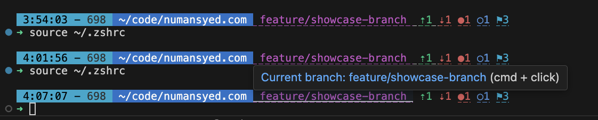
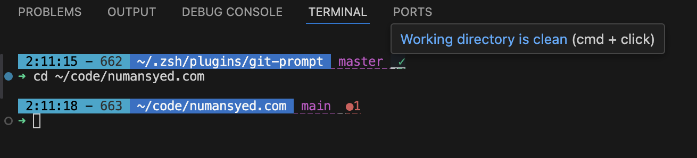
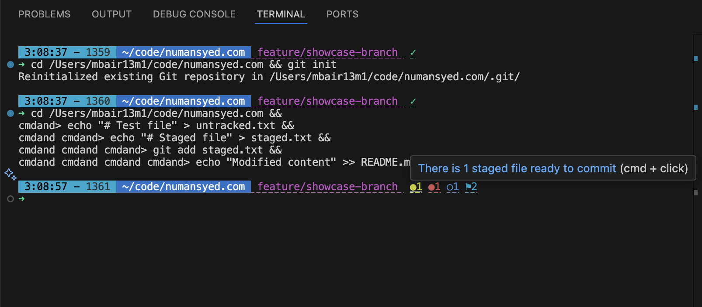
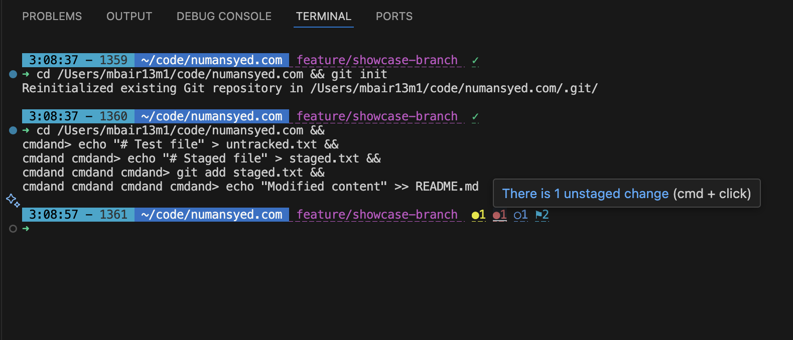
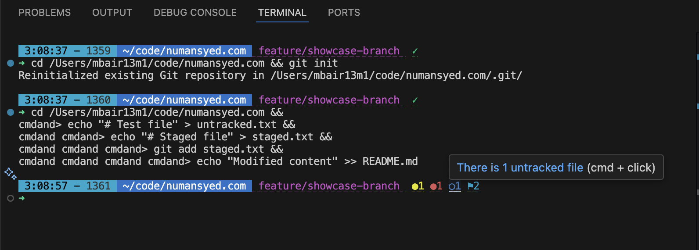
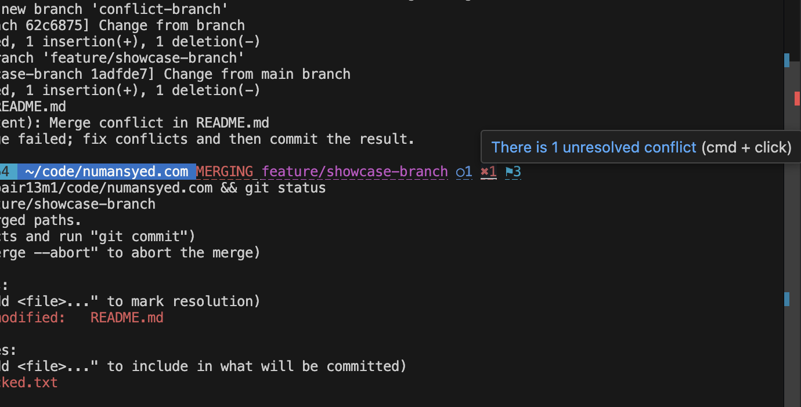
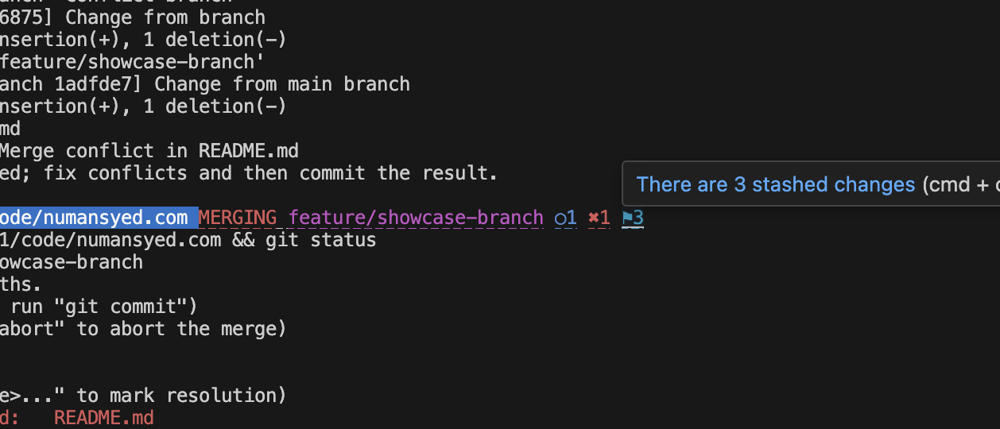
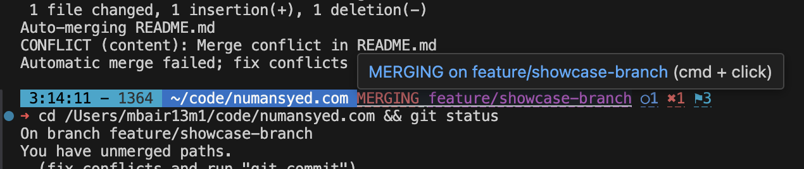

# Git Prompt with Tooltips for ZSH 🚀

A beautifully informative Git prompt for ZSH that shows repository status with helpful tooltips. Get visual feedback about your Git working directory state with intuitive icons and informative tooltips on hover.

## Features ✨

- 🎯 **Clean and minimal design** with helpful tooltips
- 🌈 **Color-coded indicators** for different Git states
- 🔄 **Real-time status updates** for your working directory
- 💡 **Hover tooltips** with detailed information
- 🎨 **Beautiful status icons** that are easy to understand

## Status Indicators

### Branch Status

- Shows current branch name in magenta
- Hover to see branch name and any special states

### Clean State

- ✓ Green checkmark indicates clean working directory
- Hover to see confirmation message

### Staged Changes

- ● Yellow dot with count shows staged files
- Hover to see number of files ready to commit

### Unstaged Changes

- ● Red dot with count shows modified files
- Hover to see number of unstaged changes

### Untracked Files

- ○ Blue circle with count shows untracked files
- Hover to see number of untracked files

### Merge Conflicts

- ✖ Red X with count shows merge conflicts
- Hover to see number of conflicts to resolve

### Stashed Changes

- ⚑ Cyan flag with count shows stashed changes
- Hover to see number of stashed changesets

### Special States

- Shows special states like MERGING, REBASING, etc.
- Branch name turns red during these states

## Installation 📦

1. Clone this repository to your ZSH plugins directory:
```bash
git clone https://github.com/numansyed/git-prompt-tooltips.git ${ZDOTDIR:-$HOME}/.zsh/plugins/git-prompt
```
   > Note: `${ZDOTDIR:-$HOME}` will use the value of `$ZDOTDIR` if set, otherwise falls back to your home directory (`$HOME`)

2. Add the plugin to your `.zshrc`:
```bash
source ${ZDOTDIR:-$HOME}/.zsh/plugins/git-prompt/git-prompt.plugin.zsh
```

3. Add the prompt function to your `PROMPT` variable in `.zshrc`:
```bash
PROMPT='${time_info}${current_dir}$(__git_prompt)${ret_status} '
```
   > This is an example prompt that includes time, current directory, git status, and return status. Customize it to your needs.

## Requirements 🛠

- Zsh shell
- Git
- A terminal that supports OSC-8 hyperlinks (most modern terminals do)

## License 📄

MIT License - See LICENSE file for details

## Author ✍️

Numan Syed

---
❤️ If you find this plugin helpful, consider giving it a star on GitHub!
